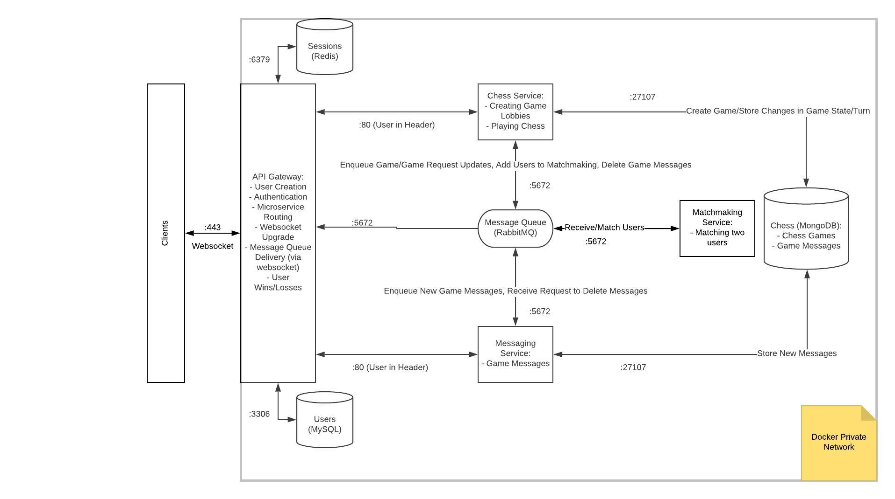

# GoChess
Go Chess is a web application that allows users to play a game of chess against a human opponent with real-time text chat.

## What
Our system will allow a player to find and play a game of chess against another human opponent. The platform is similar to Chess.com but focused on adding to an open source Golang library. Users will be able to create accounts and track their wins through our system. Furthermore, users will be able to play games of chess with their friends as well as strangers. We will also implement a messaging system which will also allow users to chat with one another during a match.

## Why
Our main task is to build a platform that utilizes a pre-existing chess library (https://github.com/notnil/chess) to facilitate creating and playing a game of chess through a REST API. Our target audience is current chess players and anyone interested in learning how to play chess.

## Architectural Diagram


## User Stories

| Priority | User | Description | Implementation | Service |
|---|---|---|---|---|
| P0 | As a new user | I want to be able to sign up for a new account | Upon receiving a POST request to /v1/users, the gateway creates a new user account and stores it in the user database. | API gateway |
| P0 | As a returning user | I want to be able to sign in and out of my account | **Sign in:** Upon receiving a POST request to /v1/sessions, the gateway verifies the user credentials and provides a bearer token for calls that require authentication. **Sign out:** Upon receiving a DELETE request to /v1/sessions/mine, the gateway ends the session for the currently authenticated user. | API gateway |
| P0 | As an authenticated user | I want to be able to request a game with a stranger | Upon receiving a POST request to /v1/games the user who requested the game will be sent to the matchmaking service. This service will match the user against another random user. | Chess + matchmaking microservices |
| P0 | As an authenticated user in a game | I want to be able to see what the board currently looks like (where all the pieces are located) | Upon receiving a GET request to /v1/games/{id}, an SVG of the current game state is sent. | Chess microservice |
| P0 | As an authenticated user in a game | I want to be able to move my piece from one place to another | Upon receiving a PATCH request to /v1/games/{id} the move is validated by checking if it is the turn of the user sending the request. The move is also validated using chess logic. **Valid move:** The updated information in the database is returned and an SVG sent to a message queue and delivered via websocket by the API server to the players. **Invalid move:** plain text message stating why the move is invalid. | Chess microservice (+ API gateway for websocket handling) |
| P0 | As an authenticated user in a game | I want to know when I have won or lost a game | Upon receiving a PATCH request to /v1/games/{id} that either is checkmate or surrender, a message is sent to to the message queue specifying the winner of the lobby and broadcast to the players. The lobby and all messages are also deleted. | Chess + messaging microservices (+ API gateway for websocket handling) |
| P1 | As an authenticated user in a game | I want to be able to surrender a game | Upon receiving a PATCH request to /v1/games/{id} that includes a surrender flag, the game is ended (see above). | Chess + messaging microservices (+ API gateway for websocket handling) |
| P1 | As an authenticated user in a game | I want to be able to send messages to the person I am playing against | Upon receiving a POST request to /v1/chat/{id}, the chat microservice will post a new message to the specific channel that is then sent to the message queue. It is parsed by the gateway, and then sent to the receiving clients through websockets. | Messaging microservice (+ API gateway for websocket handling) |
| P2 | As a user | I want to be able to track wins/losses | Upon receiving a GET request to /v1/stats/{id} the win/loss ratio of the user with that id are returned. | API gateway |
| P2 | As an authenticated user in a game | I want to be able to check for valid moves | Upon receiving a GET request to /v1/games/:gameid/moves, a list of possible moves are returned. | Chess microservice |
| P3 | As an authenticated user | I want to be able to request a game with my friend (by knowing their username) | Upon receiving a POST request to /v1/games with a user name in the body, a request to play a match is created and a message sent to the user with the matching username. | Chess microservice (+ API gateway for websocket handling) |
| P3 | As an authenticated user | I want to be able to accept/reject a targeted game request | Upon receiving a POST request to /v1/requests/{id}: **Acceptance:** a lobby is created for the sender and acceptor of the match request. The notification that the game has begun is sent to the message queue and broadcast via websocket to the appropriate clients. **Denial:** A message is sent to the message queue to be delivered to the sender of the request that the request was denied. | Chess microservice (+ API gateway for websocket handling) |

## Database Schema

### Users
**MySQL**
```
create table if not exists users (
    id int not null auto_increment primary key,
    email varchar(254) not null unique,
    pass_hash binary(60) not null,
    user_name varchar(255) not null unique,
    first_name varchar(64) not null,
    last_name varchar(128) not null,
    photo_url char(64) not null,
    wins int not null,
    losses int not null
);
```

### Sessions
**Redis**

Key-value store

Key: session ID

Value: session state - start time and user profile

### Games
**MongoDB**
```
{
    _id: {unique auto-generated ID},
    players: {array of two user IDs},
    turn: {user ID},
    gameState: {string (FEN)}
}
```

### Messages
**MongoDB**
```{JSON}
{
    _id: {unique auto-generated ID},
    gameID: {foreign key relationship with game storage},
    creator: {JSON user profile},
    body: {string},
    createdAt: {datetime}
}
```

### Requests
**MongoDB**
```{JSON}
{
    _id: {unique auto-generated ID},
    user: {ID of user making request}
}
```

## API Reference

### Gateway

#### /v1/users
**POST**

Creates a new user account. The Content-Type header must be application/json. The request body is in JSON with fields: email, password, passwordConf, and userName. Password and passwordConf must match and email and userName must be unique. A copy of the created user is sent as a response.
- 201: Successfully created user.
- 400: The request body is not a valid user.
- 415: Content-Type not application/json.
- 500: Internal server error.

#### /v1/sessions
**POST**

Creates a new user session. The Content-Type header must be application/json. The request body is in JSON and has email and password.
- 201: Successfully created session.
- 400: The request body is not valid.
- 403: Incorrect email and/or password.
- 415: Content-Type not application/json.
- 500: Internal server error.

#### /v1/sessions/mine
**DELETE**

Ends the session for the currently authenticated user. The last part of the path must be mine.
- 200: Successfully ended session.
- 403: The last part of the path is anything but mine.
- 500: Internal server error.

#### /v1/stats/:id
**GET**

Gets the win/loss statistics for the specified user.
- 200: Successful request.
- 400: Invalid :id.
- 500: Internal server error.

### Chess Service

#### /v1/games
**POST**

Creates a request to play a match. If a JSON body is included that has a username, the request is sent to that specific user. If there is no JSON body, a message is sent to the matchmaking service, which finds the player a match. The notification that the game has started is sent to the message queue and on to the clients via websocket.

Body included:
- 400: The request body is not valid.
- 415: Content-Type not application/json.

Both:
- 201: Successfully added player to queue/sent request.
- 401: Tried to call when not authenticated.
- 500: Internal server error.

#### /v1/games/:id
**GET**

A .png of the current board state in the game identified by :id is sent back. Must be one of the two players in that game to request.
- 200: Successful request.
- 401: Not authenticated.
- 403: Not one of the two players.
- 500: Internal server error.

**PATCH**

Makes the move specified in the request body in game. Returns the updated state in the database or a victory/defeat message if the move is valid. If invalid, states the reason (invalid move or not that user's turn). Can also send a surrender.
- 200: Successful move.
- 400: Tried to make a move when not that user’s turn/invalid request body/invalid move.
- 401: Tried to make a move when not authenticated.
- 403: Tried to make a move when not one of the two players.
- 415: Content-Type not application/json.
- 500: Internal server error.

#### /v1/requests/:id
**POST**

Handles a game request sent by another user. The body should specify the action (accept or reject).
- 200: Successful rejection.
- 201: Successful acceptance.
- 400: Invalid request body.
- 401: Tried to call when not authenticated.
- 415: Content-Type not application/json.
- 500: Internal server error.

#### /v1/games/:gameid/moves
**GET**

Shows all possible moves for the given game.
- 200: Successful request.
- 400: Invalid piece position.
- 401: Tried to call when not authenticated.
- 403: Not one of the two players.
- 500: Internal server error.

### Messaging Service

#### /v1/chat/:id
**POST**

Posts a message in the game specified by :id. This message is also sent to a message queue so clients can be updated via websocket.
- 201: Successful creation.
- 400: Invalid request body.
- 401: Tried to call when not authenticated.
- 415: Content-Type not application/json.
- 500: Internal server error.

## Message Queue Reference
### matchmaking
- Producer: Chess service.
- Consumer: Matchmaking service.
- Message Details: Chess service sends a user ID for matchmaking to find another user to match against.

### newGame
- Producer: Matchmaking service.
- Consumer: Chess service.
- Message Details: Matchmaking service sends a comma separated pair of user IDs to create a game for.

### updates
- Producer: Chess + messaging services.
- Consumer: API gateway.
- Message Details: Chess service sends messages for new game, updated game, and end of game. Messaging service sends messages for new posts in game chat.

#### New Game
```{JSON}
{
    type: "game-new",
    gameID: {ID of new game},
    players: {two player IDs}
}
```

#### Game Update
```{JSON}
{
    type: "game-update",
    svg: {SVG of new board},
    players: {two player IDs}
}
```

#### End of Game
```{JSON}
{
    type: "game-end",
    victor: {which player ID won. int64(-1) if a draw},
    players: {two player IDs}
}
```

#### New Message
```{JSON}
{
    type: "message-new",
    message: {message struct - including _id, body, creator, gameID, and createdAt},
    players: {two player IDs}
}
```

#### Game Request
```{JSON}
{
    type: "game-request",
    requestID: {ID of request in store},
    origin: {user name of user who requested the match},
    target: {user name of user match is requested against}
}
```

### cleanUp
- Producer: Chess service.
- Consumer: Messaging service.
- Message Details: Chess service sends the id when a game ends so the messaging service can delete all associated messages.
